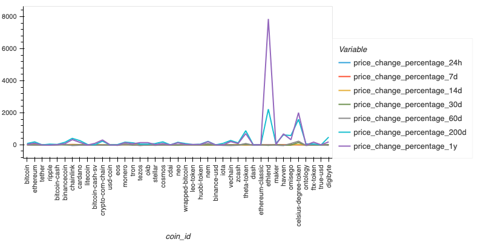
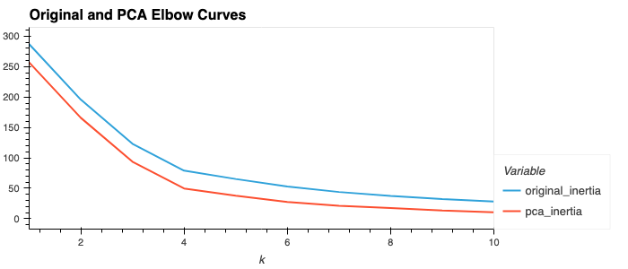

# CryptoClustering
- - -

- - -
## **Background:**
This project was created as part of a data anlaytics bootcamp. The goal is to use Python and unsupervised learning to predict if cryptocurrencies are affected by 24-hour or 7-day price changes.

Relevant Files:
- [Crypto Clustering Jupyter Notebook](Crypto_Clustering.ipynb)
    -The data analysis was completed in this notebook.
- Resources
  - [crypto_market_data.csv](Resources/crypto_market_data.csv)
  -This data was provided as part of the exercise. 
- Images
  - saved images of the data

## **Part 1: Scaling the Data**
I loaded the csv file into a Pandas dataframe, and from there prepared the data using the StandardScaler module from scikit-learn to normalize it. 

## **Part 2: Finding the best value for k and clustering the scaled data**
I then used the elbow method to find the best value for k, which is 4. Two currencies were grouped in clusters of their own, while the other currencies were grouped among the last 2 clusters. 

## **Part 3: Finding the best value for k and clustering using PCA**
Next, I used principal component analysis to condense the features of the scaled data down to 3. I then again used the elbow method to find the best value for k, which is 4, and clustered the currencies. Once again, the same 2 currencies were grouped in clusters of their own while the other currencies were grouped among the last 2 clusters. 

## **Results**
Condensing the number of features down to 3 did not change how the currencies were grouped nor what the best value for k is. 

- - -

## How to Run the App

1. Clone the repo to your computer.
   - [How to Clone Github Repo](https://docs.github.com/en/repositories/creating-and-managing-repositories/cloning-a-repository)

2. Open the CryptoClustering folder in VS Code on your personal computer.

3. Navigate to the [Crypto Clustering Jupyter Notebook](Crypto_Clustering.ipynb) file in the folder.

4. Connect to your kernal. 

5. Run all cells. 